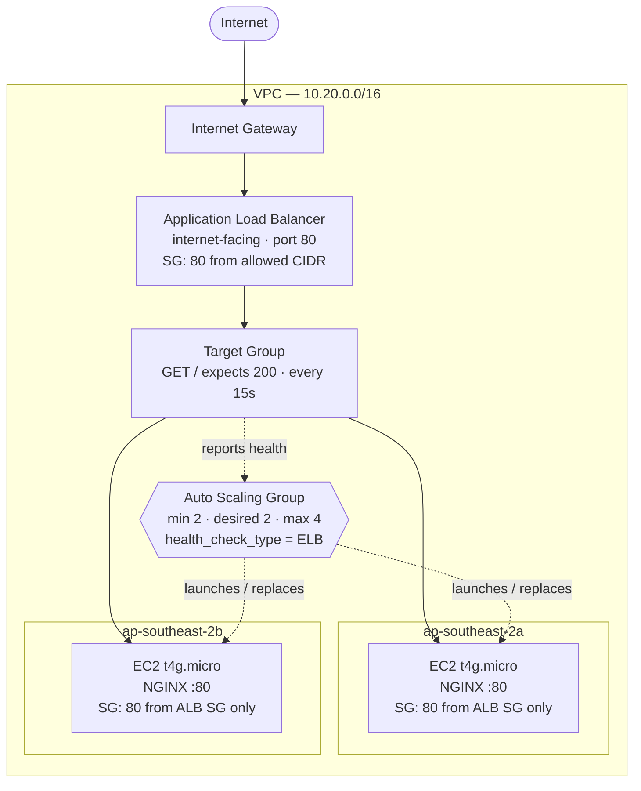
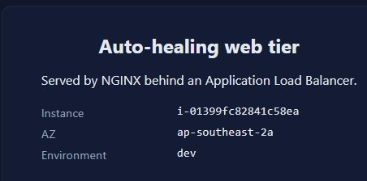
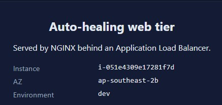
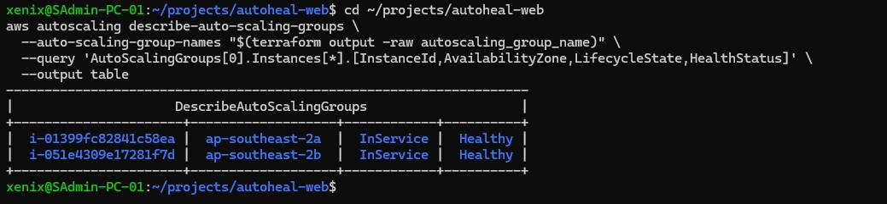
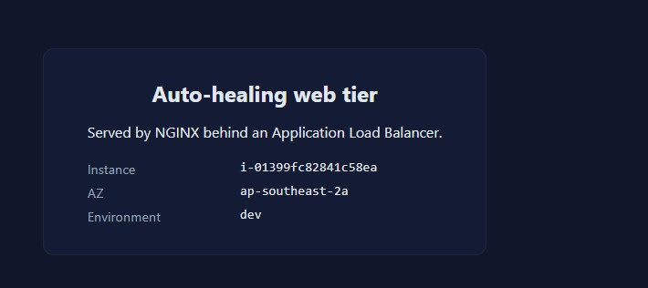
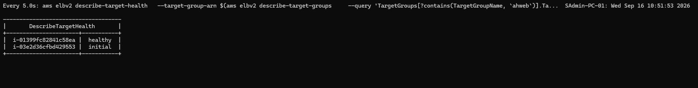
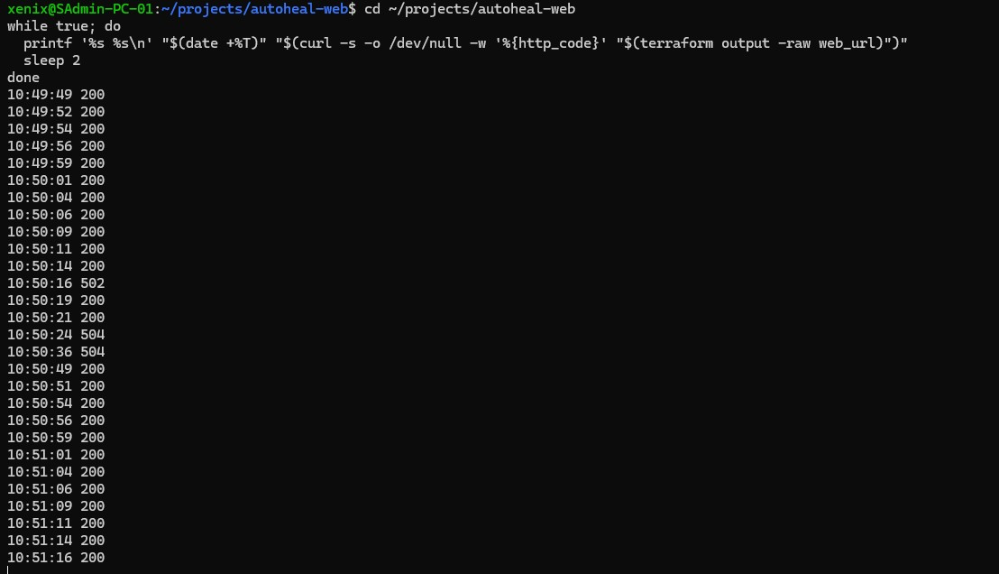
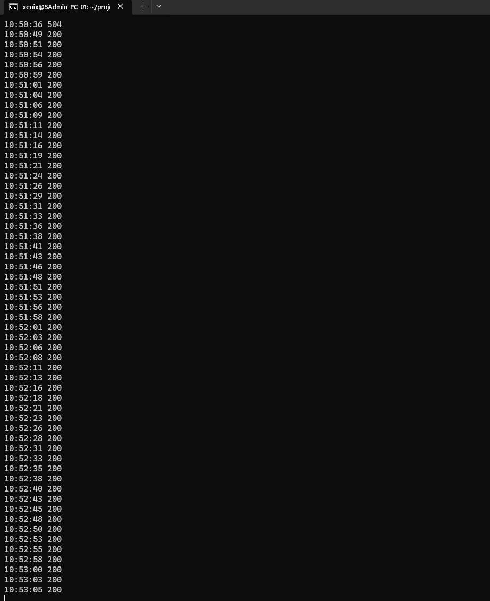
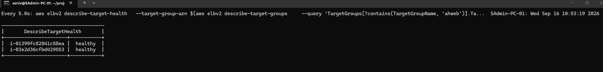

# Auto-healing web tier on AWS

Terraform that stands up an internet-facing web tier which survives the loss of
any single VM without downtime. Traffic is spread across instances in separate
Availability Zones behind an Application Load Balancer, and an Auto Scaling
Group automatically replaces any instance that is terminated or stops serving
healthy responses.

**Status:** deployed and verified end to end. See
[Demonstration](#demonstration) for evidence of the self-healing behaviour.

---

## Contents

- [Why AWS](#why-aws)
- [Architecture](#architecture)
- [How the requirements are met](#how-the-requirements-are-met)
- [Running it](#running-it)
- [Demonstration](#demonstration)
- [Idempotency](#idempotency)
- [Assumptions](#assumptions)
- [Estimated monthly cost](#estimated-monthly-cost)
- [Repository layout](#repository-layout)
- [What I would add next](#what-i-would-add-next)

---

## Why AWS

I chose AWS over Azure for three reasons:

1. **The primitive maps directly to the requirement.** An Auto Scaling Group
   with `health_check_type = "ELB"` is purpose-built for "lose any VM, get a
   replacement automatically". Azure VM Scale Sets solve the same problem, but
   the ASG plus target-group health check is the more direct expression of it.

2. **Cost fit.** Graviton (`t4g`) instances are the cheapest way to serve a
   static page, and the AWS Free Tier covers the ALB hours plus a large share of
   the instance hours — which matters given the cost constraint.

3. **No NAT Gateway required.** Placing instances in public subnets behind an
   internet-facing ALB avoids a NAT Gateway entirely — roughly AUD 68/month
   saved — while keeping the instances unreachable from the internet, because
   their security group only accepts traffic from the ALB's security group.

---

## Architecture



<details>
<summary>Text version of the diagram</summary>

```
Internet
   │
Internet Gateway
   │
Application Load Balancer      public subnets, 2 AZs
   │                            SG: port 80 from allowed CIDR
Target Group                    GET / expects HTTP 200, every 15s
   │
   ├──► EC2 instance   ap-southeast-2a   SG: port 80 from ALB SG only
   └──► EC2 instance   ap-southeast-2b   SG: port 80 from ALB SG only
             ▲
             │
   Auto Scaling Group           min 2 / desired 2 / max 4
                                health_check_type = ELB
                                replaces terminated or unhealthy instances
```
</details>

### Failure path

1. An instance is terminated or stops serving.
2. The target group health check fails twice — detected within ~30 seconds.
3. The target is deregistered; **all traffic now flows to the surviving instance.**
4. The ASG sees capacity below `desired_capacity` and launches a replacement.
5. The replacement boots, runs its cloud-init bootstrap, and installs NGINX.
6. After the grace period it passes two consecutive health checks and rejoins.

Measured in testing: **full capacity restored in under 4 minutes.** A brief
window of failed requests occurs during detection - see
[Demonstration](#demonstration) for the measured behaviour and the tuning
options that reduce it.

---

## How the requirements are met

| Requirement | Implementation |
|---|---|
| **Self-healing** | `aws_autoscaling_group` with `health_check_type = "ELB"`. Because the ASG trusts the target group's HTTP check rather than the EC2 status check, an instance that is *running but not serving* is also replaced — not just one that has failed at the hypervisor level. |
| **Self-provisioning (IaC only)** | `terraform apply` builds all 22 resources from an empty account. A second run reports no changes — see [Idempotency](#idempotency). |
| **N + 1 capacity** | `min_size = 2` across two AZs, with `vpc_zone_identifier` spanning both public subnets. Enforced in code: variable validation rejects `asg_min_size < 2` and `availability_zone_count < 2`, so the requirement fails at plan time rather than in production. |
| **Static web page** | cloud-init installs NGINX and writes an `index.html` that reports the serving instance ID and Availability Zone, making load balancing and instance replacement visible in the browser. |
| **Templates** | Terraform `>= 1.9.0`, AWS provider `~> 5.70`, split into `networking`, `security` and `web_tier` modules with input validation, consistent naming and provider-level tagging. |

### Optional bonus — containerised delivery

The module supports running the page from a container image instead of native
NGINX:

```hcl
enable_container_mode = true
container_image       = "ghcr.io/sxenix-coder/autoheal-web:latest"
```

The same cloud-init template installs Docker and runs the image with
`--restart=always`, so container-level failure recovers locally while
instance-level failure is recovered by the ASG. The image definition lives in
[`docker/`](docker/).

---

## Running it

### Prerequisites

- Terraform >= 1.9.0
- AWS credentials with permission to create VPC, EC2, ELB and IAM resources
- An AWS account (only needed for `plan`/`apply`; `validate` requires no credentials)

### Validate without credentials

```bash
terraform fmt -check -recursive
terraform init -backend=false
terraform validate
```

### Plan

```bash
cp terraform.tfvars.example terraform.tfvars   # optional — defaults are sensible
terraform init
terraform plan -out=tfplan
```

Expected: `Plan: 22 to add, 0 to change, 0 to destroy.`

### Apply

```bash
terraform apply tfplan
terraform output web_url
```

Apply takes roughly 6 minutes. The ASG step is deliberately slow: `min_elb_capacity`
holds the apply open until both instances actually pass the load balancer health
check, so a successful apply means a genuinely working site rather than just
"resources exist".

### Verify the self-healing

```bash
# Current instances
aws autoscaling describe-auto-scaling-groups \
  --auto-scaling-group-names "$(terraform output -raw autoscaling_group_name)" \
  --query 'AutoScalingGroups[0].Instances[*].[InstanceId,AvailabilityZone,LifecycleState,HealthStatus]' \
  --output table

# Continuous availability check — run in a second terminal
while true; do
  printf '%s %s\n' "$(date +%T)" \
    "$(curl -s -o /dev/null -w '%{http_code}' "$(terraform output -raw web_url)")"
  sleep 2
done

# Terminate one instance and watch the tier stay up
aws ec2 terminate-instances --instance-ids <instance-id>
```

### Tear down

```bash
terraform destroy
```

---

## Demonstration

The stack was deployed and the self-healing behaviour verified end to end.

### 1. Load balancing across both Availability Zones

The page reports the serving instance and AZ. Refreshing alternates between the
two instances.




### 2. Steady state — two healthy instances, one per AZ



### 3. After terminating an instance — the survivor keeps serving

The instance serving this page was terminated moments earlier. The site
continues to serve from the remaining instance in the other AZ.



### 4. Replacement launched automatically, mid-bootstrap

The ASG has already launched a replacement with a new instance ID. It shows as
`initial` while cloud-init installs NGINX. The surviving instance remains
`healthy` and is carrying all traffic.



### 5. Measured availability during the failure

A continuous 2-second poll of the endpoint across the termination window:



The termination produced a **33-second window** in which some requests failed -
one 502 and two 504 responses between 10:50:16 and 10:50:49 - after which the
endpoint returned 200 continuously for the remainder of the test:



**Why the failures occur, and why they are intermittent rather than total:**
the instance was terminated abruptly, but the ALB does not know that yet. With
a 15-second health check interval and an unhealthy threshold of 2, detection
takes up to 30 seconds. During that window the ALB continues round-robining
across both targets, so roughly half the requests reach the dead instance and
return 502 or 504 while the other half are served normally by the surviving
instance. Once the health check deregisters the failed target, all traffic
routes to the healthy instance and errors stop.

This is the expected behaviour for an abrupt instance loss, and it is tunable:

| Change | Effect |
|---|---|
| `interval` 15s to 10s | Detection window drops from ~30s to ~20s |
| Graceful shutdown via ASG lifecycle hook | Target deregisters *before* the instance stops, eliminating in-flight errors for planned replacements |
| Lower `deregistration_delay` | Already set to 30s rather than the 300s default |

The trade-off with a shorter interval is more health check traffic and a higher
risk of marking a briefly slow instance as unhealthy. For a planned deployment
the `instance_refresh` block already handles this correctly - it drains targets
before terminating them, so rolling changes cause no errors at all. The window
above only applies to an unplanned, abrupt instance loss, which is precisely
what was being tested.

### 6. Full capacity restored

Both targets healthy again, with the replacement instance now serving.



**Measured recovery: replacement instance healthy and serving 3 minutes 28
seconds after termination (10:50:16 to 10:53:44), with a 33-second window of
partial errors during health check detection.**

---

## Idempotency

`terraform apply` run twice in succession reports **no changes**:

```
No changes. Your infrastructure matches the configuration.
Apply complete! Resources: 0 added, 0 changed, 0 destroyed.
```

Specific measures that make this hold:

- **No non-deterministic functions.** No `timestamp()`, `uuid()` or random values
  anywhere in the configuration.
- **`name_prefix` rather than `name`** on the launch template, ASG, IAM role,
  instance profile, ALB and target group, combined with `create_before_destroy`,
  so a replacement never collides with an existing name.
- **`ignore_changes = [desired_capacity]`** on the ASG, so manual or
  policy-driven scaling does not register as configuration drift.
- **`user_data` is a pure function of its inputs** — rendered by `templatefile()`
  from static values and base64-encoded, producing an identical string every run.
- **AMI pinning available.** By default the latest Amazon Linux 2023 AMI is
  resolved via a data source. That keeps instances patched, but AWS publishes new
  AMIs periodically, so a plan run weeks later may show a launch template update.
  Setting `ami_id` pins it and removes that source of drift. This is a deliberate
  trade-off between staying patched and being frozen.

---

## Assumptions

1. **HTTP only.** No TLS listener, because that requires a domain and an ACM
   certificate, neither of which is in scope. In production I would add an HTTPS
   listener on 443 with an ACM certificate and redirect 80 → 443.

2. **Public subnets, no NAT Gateway.** Instances need outbound access for package
   installation. A private-subnet design with a NAT Gateway is more conventional
   but adds roughly AUD 68/month for no security benefit here — the instances are
   already unreachable from the internet at the security group level.

3. **No SSH.** There is no inbound SSH rule and no key pair. Shell access is via
   SSM Session Manager, using the IAM role attached to the instances. Nothing to
   leave open, no key to rotate, and sessions are auditable through CloudTrail.

4. **Local state.** Remote S3 state with DynamoDB locking is stubbed out in
   `versions.tf` and would be enabled for any shared or production use. Local
   state is sufficient for a single-author exercise.

5. **Static content only.** No database, session store or persistent data, so
   instances are entirely disposable — which is what makes this self-healing
   approach valid. A stateful tier would need a different design.

6. **Single region.** Multi-region failover would require Route 53 health-checked
   routing. The brief's requirement is satisfied by multi-AZ.

7. **Instance type.** The module defaults to `t4g.nano` for cost. The AWS account
   used for testing restricts launches to Free-Tier-eligible instance types, so
   `t4g.micro` was set via `terraform.tfvars` — the smallest eligible Graviton
   option, preserving the ARM architecture and the cost rationale. Because the AMI
   architecture is derived from the instance type, this required no other change.

8. **Service-linked roles.** The configuration assumes the
   `AWSServiceRoleForAutoScaling` service-linked role exists. AWS creates it
   automatically on first ASG use, but on a brand-new account it is possible to
   hit a race where the ASG attempts to validate the load balancer configuration
   before the role is available.

---

## Estimated monthly cost

Region `ap-southeast-2` (Sydney), assuming the stack runs 24×7 with negligible
traffic. Converted at approximately AUD 1.00 = USD 0.65.

### Within the AWS Free Tier

| Component | Usage | Cost |
|---|---|---|
| Application Load Balancer | 750 hrs/month free | **AUD 0.00** |
| EC2 `t4g.micro` × 2 | 750 hrs free, ~710 hrs billable | **~AUD 8.00** |
| EBS gp3 8 GB × 2 | within 30 GB free tier | **AUD 0.00** |
| Data transfer | within 100 GB free tier | **AUD 0.00** |
| **Total** | | **≈ AUD 8 / month** ✅ |

### Outside the Free Tier

| Component | Usage | Cost |
|---|---|---|
| Application Load Balancer | 730 hrs @ USD 0.0288/hr | ~AUD 32.30 |
| ALB capacity units | minimal traffic | ~AUD 9.00 |
| EC2 `t4g.micro` × 2 | 1,460 hrs @ USD 0.0084/hr | ~AUD 18.90 |
| EBS gp3 8 GB × 2 | 16 GB @ USD 0.096/GB-month | ~AUD 2.40 |
| **Total** | | **≈ AUD 62 / month** |

### On the ≤ AUD 20 target

I want to be straightforward rather than present a number that does not survive
scrutiny.

The target **is met** within the Free Tier (≈ AUD 8/month), and the actual cost
incurred during this exercise was **under AUD 2**, since the stack was deployed
only briefly for verification and destroyed immediately afterwards.

Outside the Free Tier the target is **not achievable** while running a 24×7
Application Load Balancer — the ALB alone is roughly AUD 32/month before any
compute. If the constraint had to hold on a non-Free-Tier account, the options
would be:

- **Drop the load balancer** and use Route 53 multi-value answer routing with
  health checks across two Elastic IPs (~AUD 1/month for the hosted zone). This
  retains self-healing and N+1, but loses layer-7 features and failover becomes
  DNS-TTL-bound rather than immediate.
- **Run only during business hours** via scheduled scaling actions, cutting both
  compute and ALB hours by roughly 75%.
- **Replace the ALB with a Network Load Balancer** — similar hourly rate, so not a
  meaningful saving.

I kept the ALB because the brief explicitly asks for a load balancer and for no
downtime, and DNS-based failover does not meet the "without downtime" bar as
cleanly.

---

## Repository layout

```
.
├── main.tf                      # Locals, data sources, module wiring
├── variables.tf                 # 16 root inputs with validation
├── outputs.tf                   # URL, ASG name, self-healing test command
├── providers.tf                 # AWS provider + default_tags
├── versions.tf                  # Version pins, remote state stub
├── terraform.tfvars.example
├── modules/
│   ├── networking/              # VPC, subnets, IGW, route tables
│   ├── security/                # ALB and instance security groups
│   └── web_tier/
│       ├── iam.tf               # Instance role for SSM access
│       ├── alb.tf               # Load balancer, target group, listener
│       ├── launch_template.tf   # Instance blueprint + cloud-init
│       ├── asg.tf               # Auto Scaling Group (self-healing)
│       └── templates/
│           └── user-data.sh.tftpl
├── docker/                      # Optional containerised page
│   ├── Dockerfile
│   └── index.html
└── docs/screenshots/            # Verification evidence
```

### Naming and tagging conventions

**Names** follow `<project>-<environment>-<resource>`, e.g.
`autoheal-web-dev-vpc`. The ALB and target group use a shortened prefix because
AWS caps `name_prefix` at six characters for those resource types.

**Tags** are applied globally through the provider's `default_tags` block —
`Project`, `Environment`, `Owner`, `CostCentre`, `ManagedBy`. Individual
resources only add a `Name` tag, so the tag set stays consistent everywhere and
a new resource cannot accidentally be left untagged.

---

## Design notes worth calling out

**ELB health checks, not EC2.** `health_check_type` defaults to `"EC2"`, which
only verifies that the hypervisor considers the instance alive. An instance whose
web server has crashed passes that check. Setting it to `"ELB"` ties the ASG to
the target group's HTTP check, so "healthy" means "actually serving".

**Security group chaining.** The instance security group permits port 80 from the
ALB's *security group* rather than a CIDR range. If the ALB scales or changes
addresses, the rule still holds — and the instances remain unreachable from the
internet despite sitting in public subnets.

**Separate rule resources.** Security group rules are declared as individual
`aws_vpc_security_group_*_rule` resources rather than inline blocks, because the
two groups reference each other. Inline blocks would create a circular dependency
in Terraform's graph.

**IMDSv2 enforced.** `http_tokens = "required"` on the launch template blocks the
SSRF class of credential theft, and `http_put_response_hop_limit = 1` prevents
containers on the instance from reaching the metadata service.

---

## What I would add next

- HTTPS listener with an ACM certificate and HTTP → HTTPS redirect
- Target-tracking scaling policy on CPU, so the tier scales as well as heals
- CloudWatch alarms on unhealthy host count and ALB 5xx rate
- Remote state in S3 with DynamoDB locking
- `terraform-docs` in CI so module documentation is generated rather than hand-maintained
- Restricted `allowed_http_cidr` rather than leaving the ALB open to the internet
